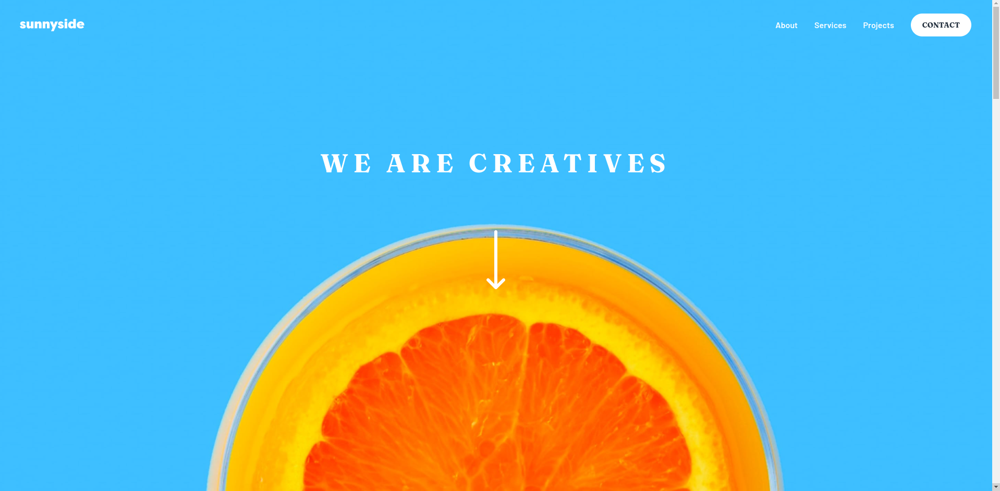

# Frontend Mentor - Sunnyside agency landing page solution

This is a solution to the [Sunnyside agency landing page challenge on Frontend Mentor](https://www.frontendmentor.io/challenges/sunnyside-agency-landing-page-7yVs3B6ef).

## Content

- [Overview](#overview)
  - [The challenge](#the-challenge)
  - [Screenshot](#screenshot)
  - [Links](#links)
- [My process](#my-process)
  - [Built with](#built-with)
- [Author](#author)

## Overview

### The challenge

Users should be able to:

- View the optimal layout for the site depending on their device's screen size
- See hover states for all interactive elements on the page

### Screenshot

### Links

- Solution URL: [Frontend Mentor](https://www.frontendmentor.io/solutions/responsive-page-using-html-sass-and-js-es6-vite-Pbs1ZMN7Jm)
- Live Site URL: [Vercel](https://sunnyside-agency-landing-page-main-fm.vercel.app/)

## My process

### Built with

- Semantic HTML5 markup
- Flexbox
- Mobile-first workflow
- [Vite](https://vitejs.dev/) - Frontend tooling
- [SASS](https://sass-lang.com/) - For styles

## Author

- Linkedin - [Gustavo Rentería](https://www.linkedin.com/in/gustavo-renter%C3%ADa-2b7819218/)
